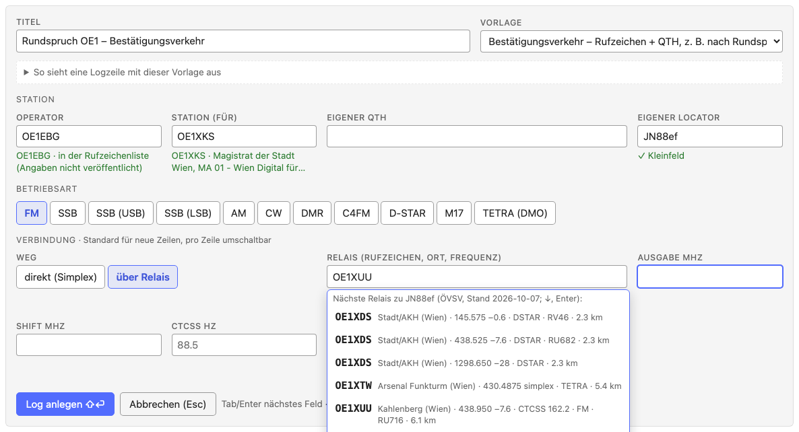
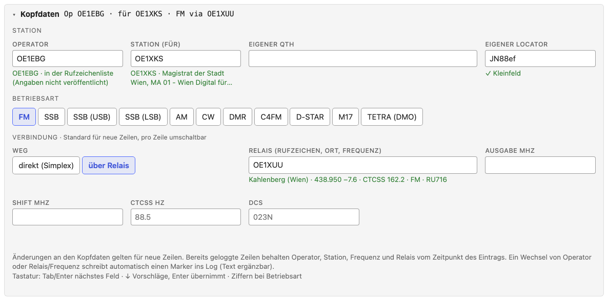
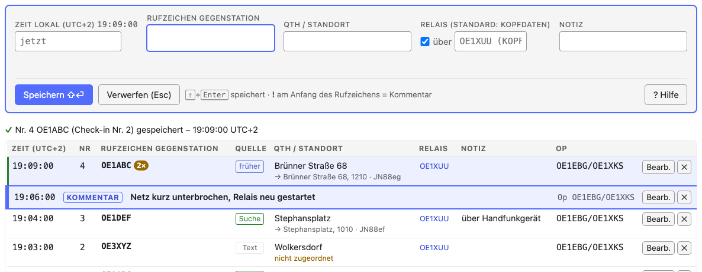
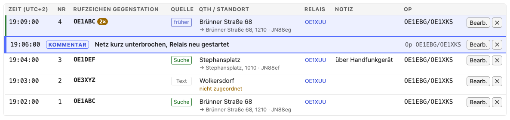
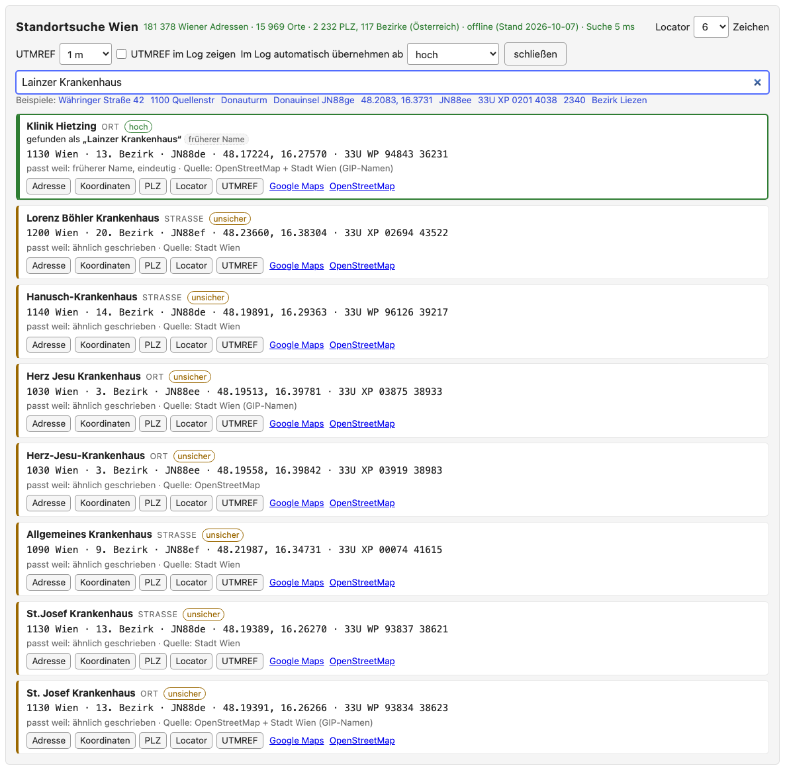
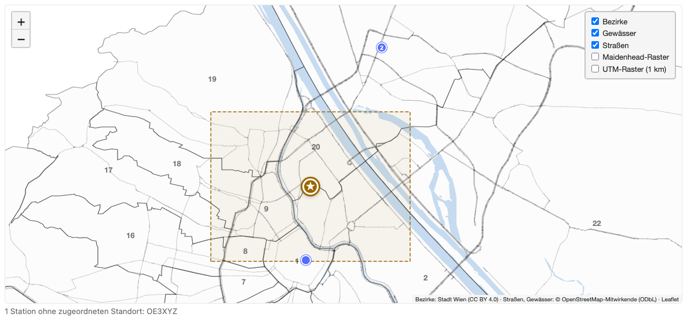
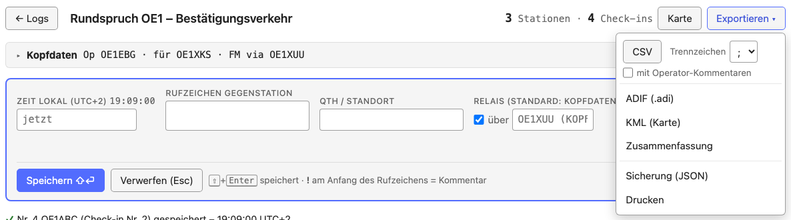
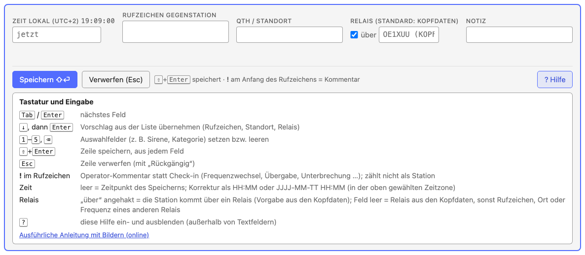

# Bestätigungsverkehr: Anleitung

[Bestätigungsverkehr öffnen →](confirm/index.html){ .tool-launch }
[Alle Tools](index.md) ·
[Offline-Datei](confirm/confirm-offline.html){ download="bestaetigungsverkehr-offline.html" } ·
[Datenquellen](data-sources.md#bestatigungsverkehr-confirmation-log) ·
[Quellcode](https://github.com/oe1ebg/tools/tree/main/tools/confirm)
{ .tool-actions }

Der [Bestätigungsverkehr](confirm/index.html) ist ein Logbuch für Runden, in
denen sich Stationen nur melden: Bestätigungsverkehr nach einem Rundspruch,
RST-Runden oder Umfragen wie den Zivilschutz-Probealarm. Er läuft vollständig
im Browser und ohne Internet; alle Daten bleiben auf dem Gerät.

Die Kurzfassung steht im Werkzeug selbst: **„? Hilfe“** unter dem
Eingabefeld oder die Taste <kbd>?</kbd> (außerhalb von Textfeldern).

## Kurz: so geht's los

1. [Bestätigungsverkehr öffnen](confirm/index.html), einmal mit Internet;
   danach läuft er auch offline ([Vorbereitung](#vorbereitung)).
2. „+ Neues Log“: Titel und Vorlage wählen ([Ein Log anlegen](#ein-log-anlegen)),
   dann Operator, Station und Relais eintragen ([Kopfdaten](#kopfdaten)).
3. Das erste Rufzeichen eintippen und mit <kbd>⇧</kbd>+<kbd>Enter</kbd>
   speichern ([Check-ins aufnehmen](#check-ins-aufnehmen)).
4. Am Ende „Exportieren ▾“ → „Sicherung (JSON)“, dazu CSV oder ADIF
   ([Export und Sicherung](#export-und-sicherung)).

## Vorbereitung

**Offline verwenden.** Beim ersten Öffnen mit Internet lädt das Werkzeug
alles, was es braucht: die österreichische Rufzeichenliste, die Relaisliste
des ÖVSV, Wiener Adressen und Orte, österreichische Postleitzahlen und
Bezirke sowie die Karte. Danach funktioniert es ohne Verbindung; „offline
bereit ✓“ oben rechts zeigt das an. Am Handy oder Tablet über „Zum
Startbildschirm hinzufügen“ als App ablegen. Für Laptops ohne Internet gibt es
die **Offline-Datei** (eine HTML-Datei, etwa 7 MB, unten auf der Startseite),
etwa für einen USB-Stick.

**Speicher.** „Speicher dauerhaft ✓“ heißt, der Browser löscht die Daten
nicht von selbst. Steht dort „nicht dauerhaft“, regelmäßig eine Sicherung
(JSON) exportieren.

**Neue Version.** Erscheint „Update verfügbar“, ist eine neue Version
geladen. Sie wird erst nach einem Klick darauf aktiv, nie mitten in einer
Runde; Logs und die halb getippte Zeile bleiben erhalten.

**Mehrere Tabs.** Ein Log sollte nur in einem Tab offen sein; sonst warnt
das Werkzeug („nur ein Tab pro Log!“).

## Ein Log anlegen

„+ Neues Log“ auf der Startseite:

- **Titel**, z. B. „Rundspruch OE1 – Bestätigungsverkehr“.
- **Vorlage:** welche Felder eine Zeile hat.
  - *Bestätigungsverkehr:* Rufzeichen und QTH / Standort.
  - *Rufzeichen + RST:* RST erhalten / gegeben, Name, QTH.
  - *Zivilschutz-Probealarm:* Standort mit PLZ, Hörbarkeit der Sirene
    (Schulnote 1–5) innen bei geschlossenem und offenem Fenster und im
    Freien, AT-Alert erhalten, sonst Handy und Version.

  „So sieht eine Logzeile mit dieser Vorlage aus“ zeigt ein Beispiel.
- **Kopfdaten** (siehe unten). Ein neues Log übernimmt die Kopfdaten des
  zuletzt angelegten.

Mit <kbd>⇧</kbd>+<kbd>Enter</kbd> oder „Log anlegen“ geht es los.

## Kopfdaten

Die Kopfdaten stehen aufklappbar über dem Eingabefeld und gelten für neue
Zeilen. Gespeicherte Zeilen behalten Operator, Station, Frequenz und Relais
vom Zeitpunkt des Eintrags.

| Feld | Bedeutung | Beispiel |
| --- | --- | --- |
| Operator | wer funkt | OE1EBG |
| Station (für) | für welche Station (Klubstation, Sonderrufzeichen) | OE1XKS |
| Eigener QTH | der eigene Standort, mit Ortssuche | Wien 1220, Wagramer Straße |
| Eigener Locator | Maidenhead-Locator des eigenen Standorts | JN88ef |
| Betriebsart | FM, DMR, C4FM, D-STAR, M17, TETRA, SSB … | FM |
| Weg | direkt (Simplex) oder über Relais | über Relais |
| Frequenz MHz | bei direkt | 145,500 |
| Relais | Rufzeichen, Ort oder Frequenz eines Relais aus der ÖVSV-Liste; setzt Ausgabe, Shift und Signalisierung | OE1XUU |

Ein **Wechsel von Operator oder Relais/Frequenz** schreibt automatisch eine
Markierung ins Log („OE1XYZ übernimmt von OE1ABC“, „OE1XUU → direkt“). Ihr
Text lässt sich ergänzen.

## Check-ins aufnehmen

- **Rufzeichen Gegenstation** eintippen. Die Vorschläge kommen aus diesem und
  früheren Logs und aus der Rufzeichenliste (Name und Ort stehen darunter).
  <kbd>↓</kbd> und <kbd>Enter</kbd> übernimmt einen Vorschlag. Ohne Markierung
  übernimmt <kbd>Enter</kbd> nur einen Vorschlag, der das Getippte vervollständigt;
  ein vollständig getipptes, unbekanntes Rufzeichen bleibt, wie es ist.
- **Zeit:** leer = Zeitpunkt des Speicherns. Korrektur als `19:42` oder
  `2026-10-08 19:42`, in der oben gewählten Zeitzone (UTC oder lokal).
- **QTH / Standort** (siehe [Standort](#standort)).
- **Relais:** „über“ angehakt = die Station kommt über das Relais aus den
  Kopfdaten. Für ein anderes Relais dessen Rufzeichen, Ort oder Frequenz
  eintragen.
- **Notiz:** freier Text.
- <kbd>⇧</kbd>+<kbd>Enter</kbd> speichert, aus jedem Feld. <kbd>Esc</kbd> verwirft die Zeile, mit
  „Rückgängig“.

**Wiederholte Check-ins.** Meldet sich eine Station ein weiteres Mal, zeigt
das Formular die früheren Check-ins und bietet „Werte vom letzten Check-in
übernehmen“ an. Im Log steht die Anzahl neben dem Rufzeichen (2×).

**Operator-Kommentare.** Beginnt die Eingabe im Rufzeichenfeld mit **`!`**,
wird daraus ein Kommentar statt eines Check-ins: „!Netz pausiert“,
„!Wechsel auf 145,500“. Eine Kategorie (Frequenzwechsel, Schichtwechsel /
Übergabe, Unterbrechung, Technik, Sonstiges) wählt man mit den Ziffern
<kbd>1</kbd>–<kbd>5</kbd>. Kommentare zählen nicht als Station und kommen nie ins ADIF.

## Das Log

Neueste Zeile oben. Oben stehen die Zahlen: Stationen und Check-ins.
„Bearb.“ bearbeitet eine Zeile (die vorige Fassung bleibt gespeichert), ✕
löscht sie (wiederherstellbar unter „Gelöschte Zeilen und automatische
Sicherungen“). Die Spalte **Quelle** sagt, woher der Standort kommt: *Suche*
(Ortssuche), *früher* (aus einem früheren Check-in), *Call* (Lizenzadresse
aus der Rufzeichenliste), *Text* (keinem Ort zugeordnet).

## Standort

Das Feld QTH / Standort und die Standortsuche (📍 Standort oben rechts)
finden offline:

- Wiener Adressen, Straßenecken („Praterstern / Lassallestraße“), Plätze,
  Haltestellen, Spitäler, Schulen und andere bekannte Orte, auch unter
  umgangssprachlichen oder früheren Namen;
- Orte um Wien und für ganz Österreich Postleitzahlen, Gemeinden und
  Bezirke;
- Koordinaten, Maidenhead-Locator und UTMREF (MGRS).

Ein sicherer Treffer wird automatisch übernommen (✓ mit „exakt“ oder „hoch“),
sonst wählt man aus den Vorschlägen. Was nicht zugeordnet werden kann, wird
als Text gespeichert. In der Standortsuche lassen sich die Genauigkeit des
Locators und des UTMREF und die Schwelle für die automatische Übernahme
einstellen.

## Karte

„Karte“ zeigt alle Stationen mit Standort auf einer Wien-Karte, ohne
Internet: Bezirke, Gewässer, Hauptstraßen und auf Wunsch das Locator-Gitter.
Ein Stern ist der eigene Standort, eine Zahl am Punkt zeigt wiederholte
Check-ins. Ein unsicherer Treffer ist ein hohler, gestrichelter Kreis.
Stationen ohne Standort stehen unter der Karte.

## Export und Sicherung

„Exportieren ▾“:

| Export | Inhalt |
| --- | --- |
| CSV | eine Zeile pro Check-in, für Excel; Trennzeichen `;` (deutsches Excel) oder `,`; optional mit Operator-Kommentaren. Werte, die mit `=`, `+`, `-` oder `@` beginnen (z. B. eine Notiz „- Akku leer“), bekommen ein `'` vorangestellt, damit Excel sie nicht als Formel ausführt; Zahlen wie `-10` bleiben unverändert |
| ADIF (.adi) | für Logbuchprogramme, ADIF 3.1.7; über Relais mit `PROP_MODE=RPT` |
| KML (Karte) | Stationen mit Standort für Google Earth / Google My Maps |
| Zusammenfassung | Text: Rufzeichen, Statistik (beim Probealarm Sirenen-Noten und AT-Alert), Standorte, Kommentare und Operators |
| Drucken | das Log als Tabelle |
| Sicherung (JSON) | das ganze Log, auch gelöschte Zeilen; auf der Startseite mit „Sicherung importieren…“ wieder einspielen |

Ein Hinweis neben dem Titel erinnert an eine Sicherung, wenn seit dem letzten
Export viele Zeilen dazugekommen sind. Auf der Startseite sichert „Alle
sichern (JSON)“ alle Logs auf einmal.

## Zeit: UTC oder lokal

Der Schalter **UTC / Lokal** oben rechts bestimmt, wie Zeiten angezeigt und
eingegeben werden. Gespeichert wird immer die genaue Zeit; CSV
(`zeitstempel_utc`) und ADIF bleiben in UTC.

## Tastatur

| Taste | Wirkung |
| --- | --- |
| <kbd>Tab</kbd> / <kbd>Enter</kbd> | nächstes Feld |
| <kbd>↓</kbd>, dann <kbd>Enter</kbd> | Vorschlag übernehmen (Rufzeichen, Standort, Relais) |
| <kbd>1</kbd> – <kbd>5</kbd>, <kbd>⌫</kbd> | Auswahlfelder (z. B. Sirene, Kategorie) setzen bzw. leeren |
| <kbd>⇧</kbd>+<kbd>Enter</kbd> | Zeile speichern, aus jedem Feld |
| <kbd>Esc</kbd> | Zeile verwerfen (mit „Rückgängig“) |
| `!` am Anfang des Rufzeichens | Operator-Kommentar statt Check-in |
| <kbd>?</kbd> | Hilfe ein- und ausblenden (außerhalb von Textfeldern) |

---

[Bestätigungsverkehr öffnen →](confirm/index.html){ .tool-launch }
{ .tool-actions }
