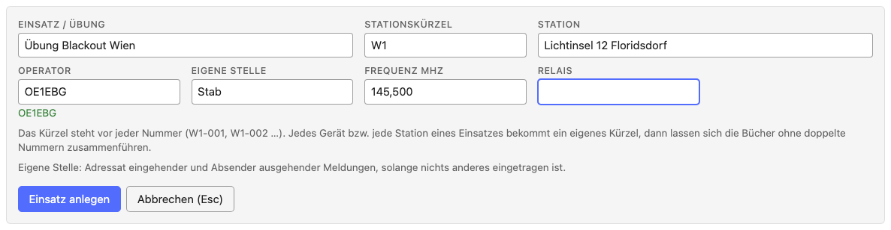
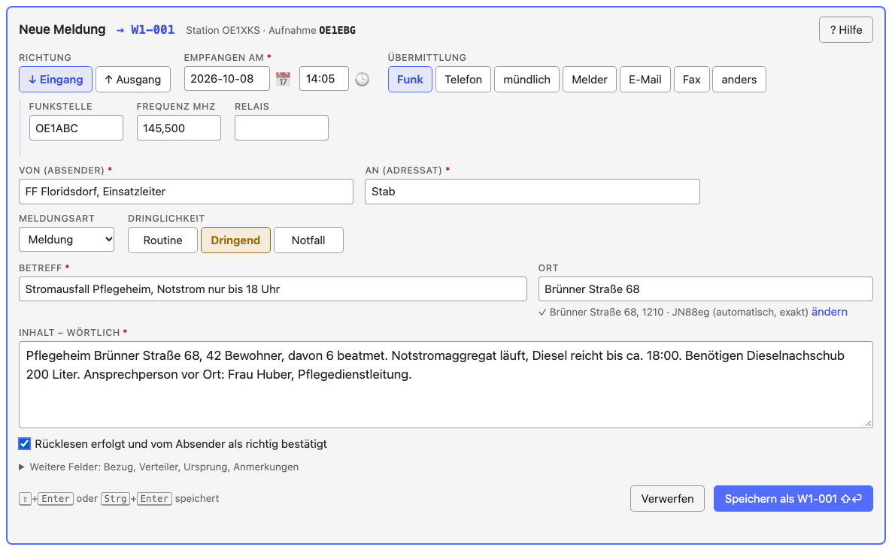
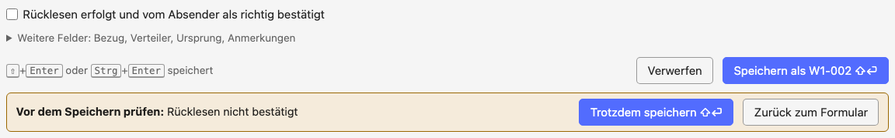
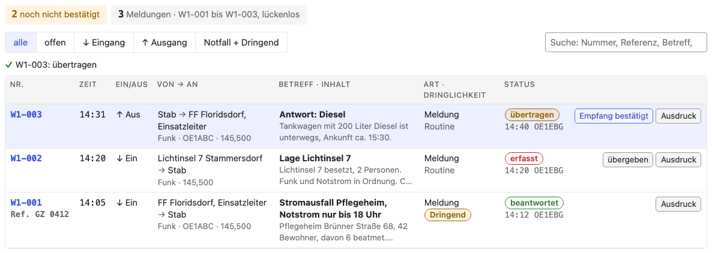
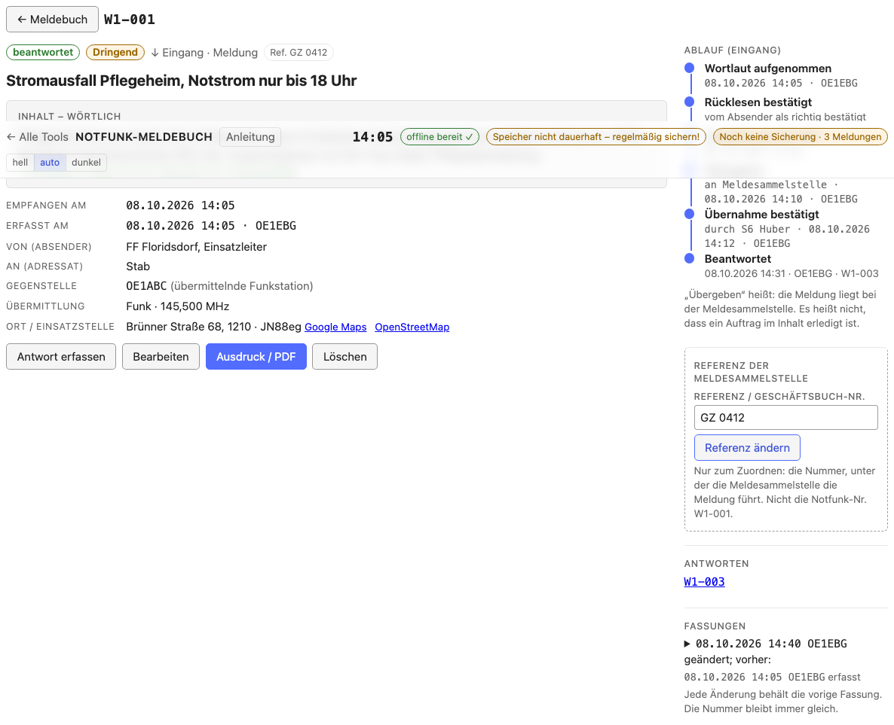
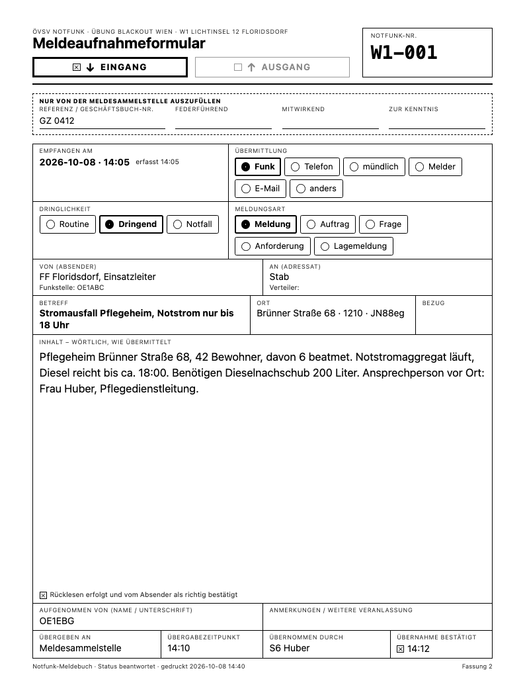
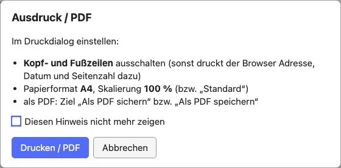
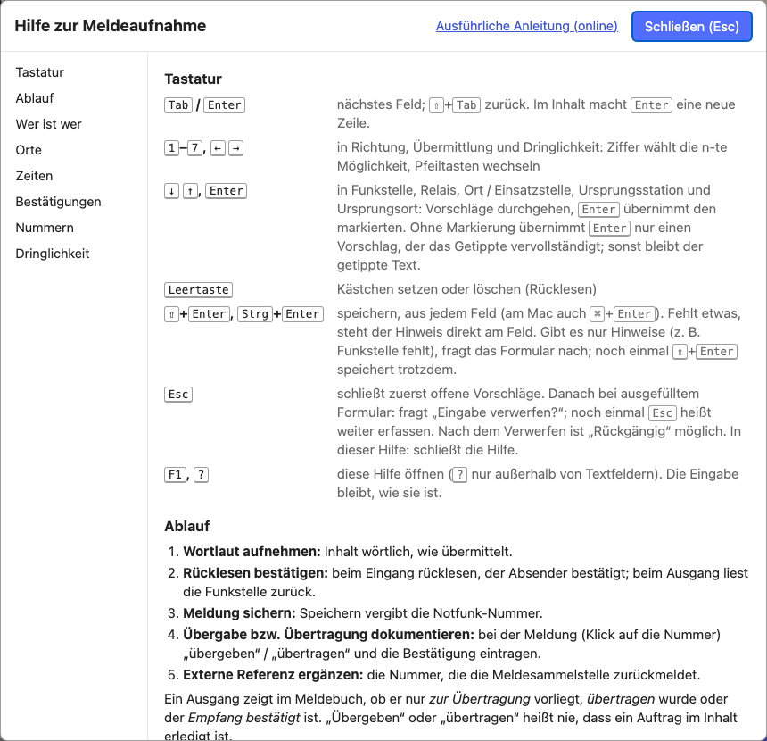

# Notfunk-Meldebuch: Anleitung

[Notfunk-Meldebuch öffnen →](notfunk/index.html){ .tool-launch }
[Alle Tools](index.md) ·
[Offline-Datei](notfunk/notfunk-offline.html){ download="notfunk-meldebuch-offline.html" } ·
[Datenquellen](data-sources.md#notfunk-meldebuch) ·
[Quellcode](https://github.com/oe1ebg/tools/tree/main/tools/notfunk)
{ .tool-actions }

Das [Notfunk-Meldebuch](notfunk/index.html) ist ein Meldebuch für den
Notfunk: Meldungen aufnehmen, lückenlos nummerieren, an die
Meldesammelstelle übergeben, übertragen und ausdrucken. Es läuft vollständig
im Browser und ohne Internet; alle Daten bleiben auf dem Gerät.

!!! warning "Entwurf"
    Das Meldungsformat ist noch nicht mit dem Notfunkreferat Wien und der
    Meldesammelstelle abgestimmt. Felder, Bezeichnungen und die
    Dringlichkeitsstufen können sich ändern. Für Übungen gedacht.

Die Kurzfassung steht im Werkzeug selbst: **„? Hilfe“** oben im Formular oder
<kbd>F1</kbd>.

## Kurz: so geht's los

1. [Notfunk-Meldebuch öffnen](notfunk/index.html), einmal mit Internet;
   danach läuft es auch offline ([Vorbereitung](#vorbereitung)).
2. „+ Neuer Einsatz“: Name und Stationskürzel eintragen
   ([Einen Einsatz anlegen](#einen-einsatz-anlegen)).
3. Die erste Meldung aufnehmen und speichern; dabei wird die Nummer vergeben
   ([Eine Meldung aufnehmen](#eine-meldung-aufnehmen)).
4. Regelmäßig eine Sicherung (JSON) herunterladen
   ([Exporte und Sicherung](#exporte-und-sicherung)).

## Vorbereitung

**Offline verwenden.** Beim ersten Öffnen mit Internet lädt das Meldebuch
alles, was es braucht (Rufzeichenliste, Relaisliste, Wiener Adressen). Danach
funktioniert es ohne Verbindung. „offline bereit ✓“ oben rechts zeigt das an.
Am Handy oder Tablet über „Zum Startbildschirm hinzufügen“ als App ablegen.
Für Laptops ohne Internet gibt es die **Offline-Datei** (eine HTML-Datei,
etwa 6 MB, unten auf der Startseite des Werkzeugs), etwa für einen
USB-Stick.

**Daten sichern.** „Speicher dauerhaft ✓“ heißt, der Browser löscht die Daten
nicht von selbst. Steht dort „nicht dauerhaft“, ist eine regelmäßige
Sicherung umso wichtiger. Der Sicherungsstand steht oben rechts
(„Letzte Sicherung 14:40 · 3 Meldungen ungesichert“); ein Klick darauf lädt
eine neue Sicherung (JSON) herunter. Die Zeit ist der Moment, in dem das
Meldebuch den Download **gestartet** hat. Ob die Datei vollständig
angekommen ist und noch irgendwo liegt, kann es nicht wissen; siehe
[Gespeichert, Entwurf und Sicherung](#gespeichert-entwurf-und-sicherung).

**Neue Version.** Erscheint „Update verfügbar“, ist eine neue Version
geladen. Sie wird erst nach einem Klick darauf aktiv, nicht von selbst. Der
Klick lädt aber **alle** offenen Tabs und Fenster des Meldebuchs neu und kann
dort laufende Eingaben unterbrechen; einen Aufschub je Tab gibt es nicht.
Gespeicherte Meldungen und die vergebenen Nummern bleiben unverändert. Beim
Neuladen versucht das Meldebuch, den halb ausgefüllten Entwurf zu sichern und
holt ihn danach zurück. Das kann scheitern (zum Beispiel bei vollem Speicher
oder wenn ein Entwurfs-Hinweis, siehe unten, angezeigt wird), und das
Neuladen läuft dann trotzdem weiter. **Deshalb vor jedem Update, in jedem
offenen Tab:** fertige Meldungen speichern und unfertige Eingaben außerhalb
des Meldebuchs kopieren, auch wenn kein Fehler angezeigt wird. Ein Entwurf
ist keine gespeicherte Meldung, und die Sicherung (JSON) enthält keine
unfertigen Eingaben. Im Einsatz lieber erst nach einer ruhigen Phase
aktualisieren.

## Einen Einsatz anlegen

| Feld | Bedeutung | Beispiel |
| --- | --- | --- |
| Einsatz / Übung | Name des Einsatzes | Übung Blackout Wien |
| Stationskürzel | steht vor jeder Nummer; jedes Gerät bzw. jede Station eines Einsatzes bekommt ein eigenes | W1 |
| **Eigene Station:** | | |
| Stationsrufzeichen | Rufzeichen der eigenen Funkstation, z. B. die Klubstation; kann vom Rufzeichen des Operators abweichen | OE1XKS |
| Standort der Station (Adresse) | wo das eigene Funkgerät steht; steht oben im Ausdruck | Lichtinsel 12 Floridsdorf |
| Für Stelle | für wen die Station arbeitet: Adressat eingehender und Absender ausgehender Meldungen, solange nichts anderes eingetragen ist | Stab |
| Frequenz, Relais | Vorgabe für neue Meldungen | 145,500 · OE1XUU |
| **Am Gerät:** | | |
| Operator | wer am Gerät aufnimmt; beim Schichtwechsel ändern | OE1EBG |

Stationsrufzeichen und Operator werden bei jeder Meldung mitgespeichert: Im
Ausdruck steht „Aufgenommen von OE1EBG, an Station OE1XKS“, im Geschäftsbuch
(CSV) gibt es eine Spalte „Stationsrufzeichen“.

Alles außer dem Stationskürzel lässt sich später im aufklappbaren Feld
**„Einsatz“** über dem Formular ändern; Änderungen gelten für neue Meldungen.
Das Stationskürzel bleibt fest, sobald die erste Meldung gespeichert ist.

**Schichtwechsel:** im Feld „Einsatz“ den Operator ändern (oder oben im
Formular auf „Aufnahme OE1EBG“ klicken). Gespeicherte Meldungen behalten den
Operator, der sie aufgenommen hat.

## Der Ablauf einer Meldung

1. **Wortlaut aufnehmen:** den Inhalt wörtlich, wie übermittelt.
2. **Rücklesen bestätigen:** beim Eingang zurücklesen, der Absender bestätigt.
   Beim Ausgang liest die Funkstelle zurück.
3. **Meldung sichern:** Speichern vergibt die Notfunk-Nummer.
4. **Übergabe bzw. Übertragung dokumentieren:** bei der Meldung „übergeben“
   (Eingang) bzw. „übertragen“ (Ausgang) eintragen, danach die Bestätigung.
5. **Externe Referenz ergänzen:** die Nummer, die die Meldesammelstelle
   zurückmeldet.

„Übergeben“ oder „übertragen“ heißt nie, dass ein Auftrag im Inhalt erledigt
ist.

## Eine Meldung aufnehmen

Das Formular steht im Meldebuch ganz oben. Die nächste Nummer wird angezeigt
(„→ W1-008“), aber erst beim Speichern vergeben.

### Die Felder

| Feld | Bedeutung | Beispiel |
| --- | --- | --- |
| Richtung | Eingang (↓) oder Ausgang (↑) | |
| Empfangen am / Gesendet am | wann die Meldung übermittelt wurde: Datum (JJJJ-MM-TT) und Uhrzeit (HH:MM, 24 Stunden) in zwei Feldern, Ortszeit. Zeigt von Anfang an jetzt und läuft mit der Uhr mit (grau), bis die Meldung begonnen wird; dann bleibt die Zeit stehen und kann korrigiert werden. `20261008` und `1405` gehen auch. Ein Klick ins Feld (oder 📅 / 🕒) öffnet einen Kalender bzw. eine Uhrzeit-Auswahl (Stunde, dann Minute), beide mit „Heute“ bzw. „Jetzt“. | 2026-10-08 · 14:05 |
| Übermittlung | Funk, Telefon, mündlich, Melder, E-Mail, Fax, anders | Funk |
| Funkstelle | die Funkstation, von der die Meldung gehört wurde (Eingang) bzw. an die sie gesendet wird (Ausgang); nur bei Funk | OE1ABC |
| Frequenz MHz, Relais | Vorgabe aus dem Einsatz; Komma oder Punkt | 145,500 · OE1XUU |
| Von (Absender) | wer die Meldung fachlich aufgibt | FF Floridsdorf, Einsatzleiter |
| An (Adressat) | für wen sie bestimmt ist | Stab, S4 |
| Meldungsart | Meldung, Auftrag, Frage, Anforderung, Lagemeldung | |
| Dringlichkeit | Routine, Dringend, Notfall (siehe unten) | |
| Betreff | kurzer Betreff | Stromausfall Pflegeheim |
| Ort | wo das gemeldete Ereignis ist; Adresse, Ort, Locator oder UTMREF | Brünner Straße 68 |
| Inhalt – wörtlich | der Wortlaut; <kbd>Enter</kbd> macht eine neue Zeile | |
| Rücklesen | „Rücklesen erfolgt und vom Absender als richtig bestätigt“ | |

Pflichtfelder sind mit * markiert: Empfangen/Gesendet am, Von, An, Betreff
und Inhalt. Fehlt eines, steht der Hinweis direkt am Feld und der Cursor
springt dorthin.

Unter **„Weitere Felder“**:

| Feld | Bedeutung | Beispiel |
| --- | --- | --- |
| Bezug | Antwort, Korrektur oder Ergänzung zu einer anderen Meldung, mit deren Nummer | Antwort auf W1-003 |
| Verteiler | wer die Meldung noch bekommt | S3, S4 |
| Ursprungsstation | Station, bei der die Meldung ursprünglich aufgegeben wurde (bei Weitergaben) | OE3XYZ |
| Ursprungsort | Ort der ursprünglichen Aufgabe | Wolkersdorf |
| Aufgabezeit | wann die Meldung dort aufgegeben wurde (nur Uhrzeit) | 13:50 |
| Stichzeit | nur bei Lagemeldungen: auf welche Uhrzeit sich die Lage bezieht | 14:00 |
| Anmerkungen / weitere Veranlassung | eigene Notizen | |

### Wer ist wer

- **Von / An** sind Absender und Adressat der Meldung selbst, etwa
  „FF Floridsdorf, Einsatzleiter“ an „Stab“.
- Die **Funkstelle** ist die Funkstation, über die die Meldung kam oder an
  die sie geht. Bei Weitergaben ist sie oft nicht die
  **Ursprungsstation**.
- Der **Operator** ist, wer hier am Gerät aufnimmt.

### Orte

- **Ort:** wo das Ereignis ist.
- **Ursprungsort:** wo die Meldung aufgegeben wurde.
- **Standort der Station (Adresse):** wo das eigene Funkgerät steht; wird im Einsatz
  eingetragen, nicht bei der Meldung.

Die Ortssuche schlägt Wiener Adressen, Orte, Plätze und Haltestellen vor und
für ganz Österreich Postleitzahlen, Gemeinden und Bezirke. Ein Vorschlag
ergänzt Postleitzahl und Locator. Der eingetippte Text bleibt, wenn nichts
passt, und der **Inhalt der Meldung wird nie verändert**.

### Zeiten

- **Empfangen am / Gesendet am:** wann die Meldung übermittelt wurde.
- **Erfasst am:** wann sie hier gespeichert wurde (automatisch).
- **Aufgabezeit:** wann sie bei der Ursprungsstation aufgegeben wurde.
- **Stichzeit:** worauf sich eine Lagemeldung bezieht.

Alle Zeiten sind **Ortszeit** (Sommer- und Winterzeit wie die Uhr an der
Wand), auf dem Bildschirm, im Ausdruck und im CSV. Aufgabezeit, Stichzeit
und die Zeitpunkte im Ablauf sind nur Uhrzeiten: gemeint ist die letzte
solche Uhrzeit vor der Meldung, nach Mitternacht also auch eine vom Vortag.

**Nachtrag vom Papier:** das tatsächliche Datum und die Uhrzeit eintragen.
Liegt die Zeit mehr als eine Stunde zurück, fragt das Formular beim
Speichern nach. Weil die Zeit mit Datum vorbelegt wird, bleibt auch eine
Meldung richtig, die vor Mitternacht begonnen und danach gespeichert wird.

**Zeitumstellung:** In der Nacht, in der im Oktober die Uhren zurückgestellt
werden, gibt es 02:00–02:59 zweimal. Fällt die Uhrzeit in diese Stunde,
erscheint neben ihr eine Auswahl „1. Mal (MESZ)“ / „2. Mal (MEZ)“,
vorbelegt mit dem, was jetzt näher liegt. Nur in dieser Stunde stehen MESZ
oder MEZ auch im Meldebuch und im Ausdruck. Im März gibt es 02:00–02:59
nicht; so eine Uhrzeit nimmt das Formular nicht an.

### Speichern, Hinweise, Verwerfen

- <kbd>⇧</kbd>+<kbd>Enter</kbd> oder <kbd>Strg</kbd>+<kbd>Enter</kbd> (am Mac auch <kbd>⌘</kbd>+<kbd>Enter</kbd>) speichert,
  aus jedem Feld.
- Fehlt nur etwas, das nicht zwingend ist (die Funkstelle), oder liegt
  die Zeit weit zurück oder in der Zukunft, erscheint **„Vor dem Speichern
  prüfen“**, und das betroffene Feld ist orange markiert. Noch einmal
  <kbd>⇧</kbd>+<kbd>Enter</kbd> oder „Trotzdem speichern“ speichert.
- <kbd>Esc</kbd> schließt zuerst offene Vorschläge. Bei ausgefülltem Formular fragt
  es dann **„Eingabe verwerfen?“**; ein zweites <kbd>Esc</kbd> heißt „weiter
  erfassen“. Nach dem Verwerfen holt „Rückgängig“ alles zurück.
- Der halb ausgefüllte **Entwurf** wird laufend zwischengesichert („✓ Entwurf
  gesichert“) und ist auch nach einem Neuladen noch da. Er ist **keine
  gespeicherte Meldung**: Eine Nummer gibt es erst beim Speichern, und ein
  Entwurf kann verloren gehen (siehe unten). Steht dort „Entwurf nicht
  gesichert!“, ist er gerade nicht im Speicher.
- **Gespeichert** heißt: Meldung und Nummer sind in einem Schritt im Speicher
  abgeschlossen. Erst dann erscheint die Meldung im Meldebuch. Schlägt das
  Speichern fehl („SPEICHERN FEHLGESCHLAGEN“), ist nichts vergeben, die Eingabe
  steht noch im Formular, und es sollte sofort eine Sicherung (JSON)
  heruntergeladen werden.

### Wenn ein anderer Tab etwas geändert hat

Ein Einsatz sollte nur in einem Tab oder Fenster bearbeitet werden. Passiert
es doch, überschreibt das Meldebuch nichts stillschweigend:

- **„NICHT GESPEICHERT – … wurde inzwischen geändert (z. B. in einem anderen
  Tab oder Fenster)“:** Die Meldung (oder der Einsatz) wurde zwischen dem
  Öffnen und dem Speichern woanders geändert. Es wurde **nichts**
  geschrieben, die aktuelle Fassung ist geladen, Ihre Eingabe steht noch im
  Formular. Prüfen und erneut speichern; übernommen werden dann nur die
  Felder, die Sie selbst geändert haben.
- **„ENTWURF NICHT GESICHERT – In einem anderen Tab oder Fenster liegt ein
  anderer Entwurf für diesen Einsatz“:** Zwei Tabs haben je einen Entwurf.
  Wählen Sie „Meinen Entwurf sichern (ersetzt den anderen)“ oder „Den
  anderen Entwurf laden (ersetzt meine Eingabe)“. Es gibt immer nur einen
  Entwurf je Einsatz.
- **„ENTWURF PRÜFEN – Dieser Entwurf stammt aus einer älteren Version des
  Werkzeugs …“:** Ein Entwurf, der eine gespeicherte Meldung bearbeitet, wurde
  vor einem Update angelegt; es ist nicht bekannt, auf welcher Fassung er
  beruht. Das Hinweisfeld nennt die abweichenden Felder. Mit „Entwurf auf die
  aktuelle Fassung anwenden“ bleibt Ihre Eingabe im Formular, mit „Entwurf
  verwerfen (gespeicherte Fassung laden)“ gilt die gespeicherte Fassung.
  Bis zur Wahl wird nichts gespeichert.
- **„ENTWURF – Die Meldung, die dieser Entwurf bearbeitet, gibt es in diesem
  Einsatz nicht mehr“:** Der Entwurf steht im Formular und würde als **neue**
  Meldung gespeichert, mit einer neuen Nummer.

### Dringlichkeit

| Stufe | Bedeutung (vorläufig) |
| --- | --- |
| Routine | alles, was in der normalen Reihenfolge bearbeitet wird |
| Dringend | vor Routine-Meldungen übermitteln und bearbeiten |
| Notfall | Gefahr für Leib und Leben oder unmittelbar drohender großer Schaden: sofort |

## Das Meldebuch

Die Meldungen stehen neueste zuerst. Oben die Zusammenfassung: offene
Notfälle, noch nicht bestätigte Meldungen, die Nummern und ob sie lückenlos
sind. Filter: alle, offen, Eingang, Ausgang, Notfall + Dringend, dazu die
Suche (Nummer, Referenz, Betreff, Station, Text).

Der **Status** hängt von der Richtung ab:

| Richtung | 1 | 2 | 3 | danach |
| --- | --- | --- | --- | --- |
| ↓ Eingang | erfasst | übergeben | übernommen | beantwortet |
| ↑ Ausgang | zur Übertragung | übertragen | Empfang bestätigt | beantwortet |

Der Knopf in der Zeile trägt den nächsten Schritt mit der aktuellen Zeit ein
(„übergeben“, „Übernahme bestätigt“, „übertragen“, „Empfang bestätigt“). Mit
Angaben (an wen, durch wen, wann) geht es bei der Meldung selbst.
„Beantwortet“ entsteht von selbst, wenn eine Antwort mit Bezug gespeichert
wird.

## Eine Meldung im Detail

Ein Klick auf die Zeile (oder die Nummer) öffnet die Meldung: Wortlaut, alle Angaben und
rechts der **Ablauf**.

- **Eingang:** „Übergeben an“ (z. B. Meldesammelstelle) mit Zeitpunkt, dann
  „Übernommen durch“ mit Zeitpunkt.
- **Ausgang:** „Übertragen an“ (die Funkstelle) mit Zeitpunkt und ob sie
  zurückgelesen hat, dann „Empfang bestätigt durch“. Klappt eine Übertragung
  nicht oder gibt es eine Rückfrage: „Fehlversuch / Rückfrage eintragen“.
- Zeitpunkt leer = jetzt; sonst die Uhrzeit, z. B. `14:10`.

**Referenz der Meldesammelstelle:** die Nummer, unter der die
Meldesammelstelle die Meldung führt (Geschäftsbuch). Sie wird hier
eingetragen, sobald sie zurückgemeldet wird, und steht dann im Meldebuch, in
der CSV und auf dem Ausdruck neben der Notfunk-Nummer. So lassen sich die
beiden Listen zuordnen. Die Notfunk-Nummer (`W1-007`) ist **nicht** die
Geschäftsbuchnummer.

Weiter bei der Meldung: **Antwort erfassen** (Richtung, Absender und Adressat
vertauscht, Bezug gesetzt), **Bearbeiten** (die vorige Fassung bleibt
gespeichert), **Ausdruck / PDF**, **Löschen** (die Nummer bleibt vergeben und wird **nie
wieder verwendet**; wiederherstellbar unter „Gelöschte Meldungen“).

## Ausdruck und PDF

Eine Meldung wird auf **eine A4-Seite** gedruckt: weißes Papier, dünne
Linien, keine schwarzen Flächen, auch aus der dunklen Ansicht.

- Oben die Richtung (**↓ EINGANG** oder **↑ AUSGANG**, die gewählte mit
  dickem Rahmen und ✕) und die Notfunk-Nummer.
- Darunter der Block **„Nur von der Meldesammelstelle
  auszufüllen“**: Referenz / Geschäftsbuch-Nr. (vorbelegt, wenn schon
  bekannt), Federführend, Mitwirkend, Zur Kenntnis.
- Datum und Uhrzeit (Ortszeit) in einem Feld: „2026-10-08 · 14:05“, dazu
  die Erfassungszeit.
- Unten die Übergabe (Eingang) bzw. Übertragung (Ausgang).

**Druckeinstellungen.** Vor dem ersten Druck erinnert ein Hinweis daran, im
Druckdialog **„Kopf- und Fußzeilen“ auszuschalten**, A4 und 100 % zu wählen.
Chrome und Edge lassen Kopf- und Fußzeilen bei diesem Blatt ohnehin weg.
Als PDF: Ziel „Als PDF sichern“ bzw. „Als PDF speichern“.

**Lange Meldungen.** Passt der Text nicht, werden zuerst die Abstände kleiner,
dann die Schrift (höchstens bis 10 pt). Reicht auch das nicht (etwa ab 2.500
Zeichen), sagt das Werkzeug vor dem Druck, wie viele Seiten es werden; jede
Seite trägt die Nummer. Es wird nie etwas abgeschnitten.

**Leere Formulare** für die Arbeit ohne Gerät: „Leeres Formular drucken /
PDF“ auf der Startseite (bzw. „Leeres Formular“ im Meldebuch), die Anzahl im
Druckdialog wählen. Das leere Formular hat dieselben Felder und Begriffe.

**Das Meldebuch drucken:** „Drucken / PDF…“ im Meldebuch, optional mit
Zeitraum (Von/Bis je Datum und Uhrzeit; nur ein Datum = der ganze Tag).

## Exporte und Sicherung

- **Geschäftsbuch (CSV):** eine Zeile pro Meldung, für Excel. Spalten u. a.
  Notfunk-Nr., Referenz Meldesammelstelle, Datum, Uhrzeit (Ortszeit),
  Zeitstempel (ISO 8601 mit Zeitzone, z. B. `2026-10-08T14:05:00+02:00`, für
  Programme), Ein/Aus, Betreff, Inhalt, Dringlichkeit, Funkstelle, Status,
  Übergabe, Bezug. Werte, die mit `=`, `+`, `-` oder `@` beginnen, bekommen
  ein `'` vorangestellt, damit Excel sie nicht als Formel ausführt (Zahlen
  wie `-10` bleiben unverändert); die Meldung nach dem Herunterladen sagt,
  wie viele. Die Sicherung (JSON) enthält die Werte unverändert.
- **Sicherung (JSON):** der ganze Einsatz mit gelöschten Meldungen, allen
  Fassungen und den Nummernzählern, **unverschlüsselt**. Sie wird aus dem
  gespeicherten Stand gelesen, also aus dem, was abgeschlossen ist (nicht
  aus dem Entwurf). Kann der Speicher nicht gelesen werden, steht beim
  Download „der Speicher war nicht lesbar, sie enthält den Stand dieses
  Tabs“. Auf der Startseite mit „Sicherung importieren…“ wieder einspielen,
  auch auf einem anderen Gerät. Bücher mehrerer Geräte lassen sich so
  zusammenführen, wenn jedes Gerät ein eigenes Stationskürzel hat.

### Gespeichert, Entwurf und Sicherung

- **Gespeichert** (im Speicher abgeschlossen) und **Entwurf** (kann verloren
  gehen): siehe [Speichern, Hinweise, Verwerfen](#speichern-hinweise-verwerfen).
- **Download gestartet ist nicht Sicherung aufbewahrt.** „Sicherung (JSON)
  heruntergeladen“ und die Zeit im Sicherungsstand heißen: Der Browser hat
  die Datei bekommen. Ob sie vollständig ist und wo sie liegt, weiß das
  Meldebuch nicht. Legen Sie die Datei an einen Ort, den Sie kontrollieren
  (anderer Datenträger, USB-Stick, anderer Rechner), und probieren Sie den
  Import aus.
- **Import:** Die Datei wird vollständig geprüft, bevor etwas geschrieben
  wird; ist sie als Ganzes unbrauchbar („Nicht importiert“), ändert sich
  nichts. Einzelne fehlerhafte Datensätze werden **ausgelassen** und mit
  Grund aufgelistet („Aus der Datei ausgelassen“); die übrigen werden
  übernommen. Das Ergebnis nennt, wie viele Meldungen neu und wie viele
  aktualisiert wurden (eine Meldung wird nur durch eine neuere Fassung
  derselben Meldung ersetzt). Meldungen, deren Nummer oder ID schon mit
  einer anderen Meldung belegt ist, erscheinen unter „Nicht übernommen
  (Nummer oder ID schon mit anderer Meldung belegt)“, Antworten auf eine
  fehlende oder nicht übernommene Meldung unter „Nicht übernommen (Bezug …)“,
  jeweils mit der Nummer. Die Nummernzähler gehen durch einen Import nie
  zurück.
- **Ersatzspeicher.** Steht in der Fußzeile „localStorage (Ersatzspeicher)“,
  war IndexedDB nicht verfügbar. Der Ersatzspeicher ist klein (rund 5 MB) und
  hat bei einer Adresse mit `http://` (statt HTTPS oder `localhost`) keine
  Sperre zwischen Tabs: **zwei Tabs könnten dieselbe Nummer vergeben.** Das
  ist eine bekannte Einschränkung; in diesem Fall nur einen Tab verwenden und
  häufig sichern. Mit IndexedDB wird eine Nummer nie doppelt vergeben. Läuft
  das Meldebuch später wieder mit IndexedDB, bietet es an, Datensätze aus
  dem Ersatzspeicher zu übernehmen („In IndexedDB übernehmen“); dabei wird
  nichts Vorhandenes überschrieben, Nummernzähler behalten den höheren Wert,
  und was sich nicht übernehmen lässt (zum Beispiel „Nummer bereits
  vergeben“), bleibt im Ersatzspeicher, wird mit Grund genannt und lässt
  sich mit „Als JSON sichern“ herunterladen.
- **Daten schützen.** Der Browser speichert die Daten und die Sicherungen
  unverschlüsselt; der Verlauf der Fassungen schützt vor Versehen, nicht vor
  Manipulation (es gibt keine Signatur). Festplattenverschlüsselung,
  Sperrbildschirm und kein gemeinsames Benutzerkonto auf geteilten Geräten
  sind Sache des Geräts. Der Browser trennt die Daten nach Adresse
  (Rechnername und Port), nicht nach Verzeichnis: Andere Seiten derselben
  Adresse können sie lesen. Für echte Einsätze das Meldebuch auf einer
  eigenen Adresse bereitstellen. Die Offline-Datei und die Seite im Netz
  haben getrennte Speicher; zum Umziehen die Sicherung verwenden.

## Tastatur

| Taste | Wirkung |
| --- | --- |
| <kbd>Tab</kbd> / <kbd>Enter</kbd> | nächstes Feld (im Inhalt: <kbd>Enter</kbd> = neue Zeile) |
| <kbd>⇧</kbd>+<kbd>Tab</kbd> | vorheriges Feld |
| <kbd>1</kbd> – <kbd>7</kbd>, <kbd>←</kbd> <kbd>→</kbd> | Auswahl in Richtung, Übermittlung, Dringlichkeit |
| <kbd>↓</kbd> <kbd>↑</kbd>, <kbd>Enter</kbd> | Vorschläge durchgehen und übernehmen (Funkstelle, Relais, Orte, Ursprung) |
| <kbd>Leertaste</kbd> | Kästchen setzen (Rücklesen) |
| <kbd>⇧</kbd>+<kbd>Enter</kbd>, <kbd>Strg</kbd>+<kbd>Enter</kbd> | speichern |
| <kbd>Esc</kbd> | Vorschläge schließen, dann „Eingabe verwerfen?“; noch einmal = weiter erfassen |
| <kbd>F1</kbd>, <kbd>?</kbd> | Hilfe (<kbd>?</kbd> nur außerhalb von Textfeldern); <kbd>Esc</kbd> schließt sie |

## Hilfe im Werkzeug

„? Hilfe“ oder <kbd>F1</kbd> öffnet die Kurzhilfe über dem Formular. Die Eingabe
bleibt, wie sie ist; nach dem Schließen ist der Cursor wieder im vorigen
Feld.

## Offene Abstimmungen

Mit der Meldesammelstelle bzw. dem Stab abzustimmen:

- Bezeichnung und Nummernschema der externen Referenz.
- Dringlichkeitsstufen und ihre Bedeutung.
- Welche Übergabe- und Empfangsbestätigungen nötig sind.
- Umgang mit Meldungen, die nicht lesbar auf eine Seite passen.

---

[Notfunk-Meldebuch öffnen →](notfunk/index.html){ .tool-launch }
{ .tool-actions }
